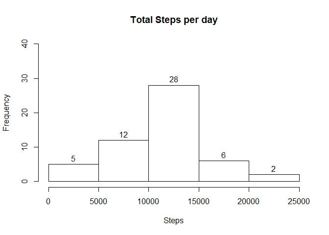
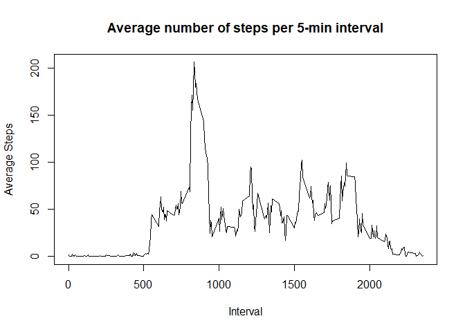
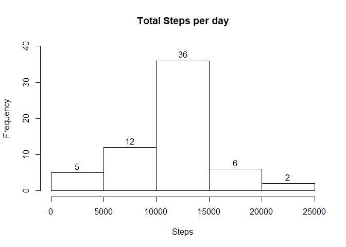
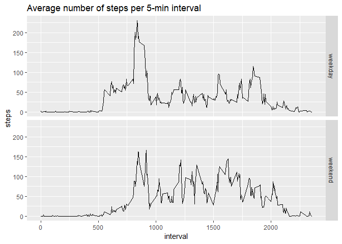

```r
library(knitr)
library(ggplot2)
```
## Loading and preprocessing the data

* Load the data

```r
data <- read.csv('activity.csv')
```

* Process/transofrm data for analysis

```r
data <- transform(data, date = as.Date(date))
```

## What is mean total number of steps taken per day?

* Aggregate the table for total steps per day, remove NA's

```r
steps_per_day <- aggregate(steps ~ date, data, sum, na.rm = TRUE)
```

* Create the plot

```r
hist(steps_per_day$steps, main = "Total Steps per day", xlab = "Steps", ylim = c(0,40), labels = TRUE)
```

<!-- -->

* Calculate and report the mean and median of total steps taken per day

Mean:

```r
mean(steps_per_day$steps)
```

```
## [1] 10766.19
```
Median:

```r
median(steps_per_day$steps)
```

```
## [1] 10765
```

## What is the average daily activity pattern?

* Aggregate data for time series plot, remove NA's

```r
mean_steps_interval <- aggregate(steps ~ interval, data, mean, na.rm = TRUE)
```

1. Create time series plot

```r
plot(mean_steps_interval$interval, mean_steps_interval$steps, type = "l", main = "Average number of steps per 5-min interval", xlab = "Interval", ylab = "Average Steps")
```

<!-- -->

2. Which 5-minute interval, on average across all days, contains the max number of steps?

```r
max_interval <- mean_steps_interval$interval[which(mean_steps_interval$steps == max(mean_steps_interval$steps))]
max_interval
```

```
## [1] 835
```

## Imputing missing values

1. Calculate and report the total number of missing values in the dataset.

```r
sum(is.na(data))
```

```
## [1] 2304
```

2. Devise a strategy for filling in missing data values.
* I will replace NA's with the mean for that 5-minute interval.

```r
imputed_data <- data
for (i in 1:length(imputed_data$steps)) {
  if (is.na(imputed_data$steps[i])) {
    imputed_data$steps[i] <- mean_steps_interval$steps[mean_steps_interval$interval == imputed_data$interval[i]]
  }
}
```

* Aggregate the filled data and make sure there are no NA steps

```r
imp_steps_per_day <- aggregate(steps ~ date, imputed_data, sum, na.rm = TRUE)
sum(is.na(imp_steps_per_day$steps))
```

```
## [1] 0
```

* Create the plot with the imputed data

```r
hist(imp_steps_per_day$steps, main = "Total Steps per day", xlab = "Steps", ylim = c(0,40), labels = TRUE)
```

<!-- -->

* The mean is the same as the mean of the data calculated with remove.na = TRUE, because we filled
in all of the missing values with that mean. The median is slightly higher, which is expected. The 
imputed data histogram is the same basic shape as the previous one, with higher frequencies at the mean.
This makes sense because we filled in the NA values with the mean, so would have more frequency there.
The mean and median are also now equal.

```r
mean(imp_steps_per_day$steps)
```

```
## [1] 10766.19
```

```r
median(imp_steps_per_day$steps)
```

```
## [1] 10766.19
```

## Are there differences in activity patterns between weekdays and weekends?

* Add a factor variable that will be either weekend or weekday, and create aggregate for plot

```r
imputed_data$date <- as.Date(imputed_data$date)
imputed_data$wkdy <- "weekday"
imputed_data$wkdy[weekdays(imputed_data$date) == "Saturday" | weekdays(imputed_data$date) == "Sunday"] <- "weekend"
imputed_data$wkdy <- as.factor(imputed_data$wkdy)
imputed_data_interval <- aggregate(steps ~ interval + wkdy, imputed_data, mean, na.rm = TRUE)
```

* Create the panel plot 

```r
g <- ggplot(imputed_data_interval, aes(interval, steps))
g + facet_grid(wkdy ~ .) + geom_line() + ggtitle("Average number of steps per 5-min interval")
```

<!-- -->
